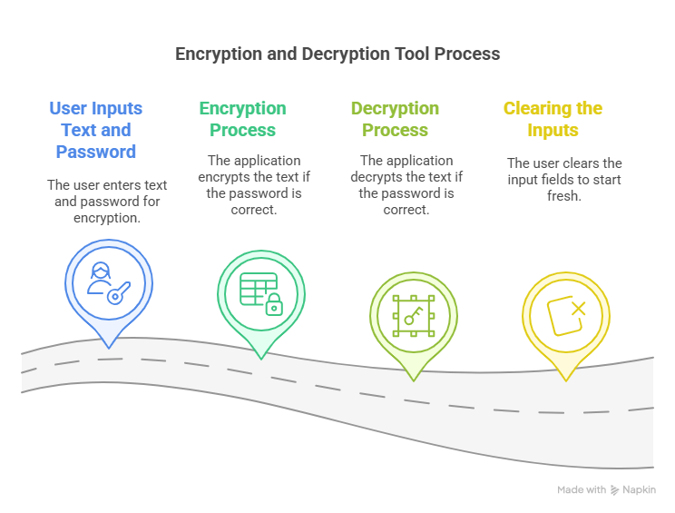

# Encryption and Decryption Tool

## Overview

This is a simple graphical user interface (GUI) tool built using Python's Tkinter library for encrypting and decrypting text using Base64 encoding. It provides a straightforward way to encrypt or decrypt messages with a password-based authentication system.



## Features

- **Encrypt**: Converts plain text to Base64 encoded text.
- **Decrypt**: Converts Base64 encoded text back to plain text.
- **Clear**: Clears the text area and the password entry field.

## Requirements

- Python 3.x
- Tkinter (usually included with Python)

## How to Run

1. Ensure you have Python installed on your system.
2. Save the script to a file, e.g., `encryption_tool.py`.
3. Run the script using the command:
   ```bash
   python main.py
